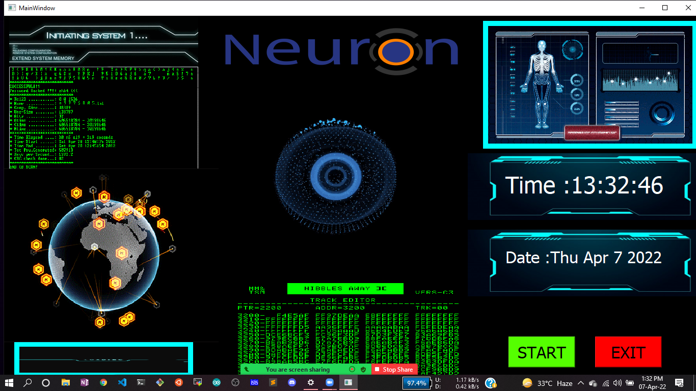

# Neuron Desktop Assistant

This is a Python based Desktop Assistant designed with PyQt5. Desktop Assistant (DA) is a software agent that can perform tasks or. services for an individual based on commands or questions. Desktop voice assistants are able to interpret human. speech and respond via synthesized voices. 

# Demo of this Project: 
[Live demo](https://youtu.be/N2Ae8_zB2Pc)

## Prerequisites
Make sure you have mongoDB installed 

#### 1. Environment setup.
```commandline
conda create --prefix ./env python=3.7 -y
conda activate ./env
```

#### 2. Install Requirements
```commandline
pip install -r requirements.txt
```

#### 3. Install Some Extra Requirements
```commandline
1. conda install pyaudio
2. pip install pyqt5-tools
3. python -m pip install pymongo
4. pip install pymongo[srv]
```

Once your installation has finished, you have to generate a secret key for encrypting your 
secret credentials

#### 4. Execute this file to secure your credentials

```commandline
python encryptSecrets.py 
```
After executing this command you will get a secret.key file, now copy the 
secret key and save it into your environment variable as SECRET_KEY and run this file again to encrypt


#### 5. Now convert to exe file 
```commandline
python convert2exe.py
```
After converting to exe copy the config.yaml file into dist folder and run the neuron.exe
## Running the app without exe
```commandline
python neuron.py
```

Results after running neuron.py or neuron.exe




#### There you go!! Now click on start button to get started 😃😃
## Built With

1. PyQt5 
2. Python
3. mongoDB 
4. shell script

## Authors
Author: BOKTIAR AHMED BAPPY

Designation: Data Scientist

Email: 1. boktiar@ineuron.ai  2. entbappy73@gmail.com
## License

This project is licensed under the MIT License - see the [LICENSE.md](LICENSE.md) file for details